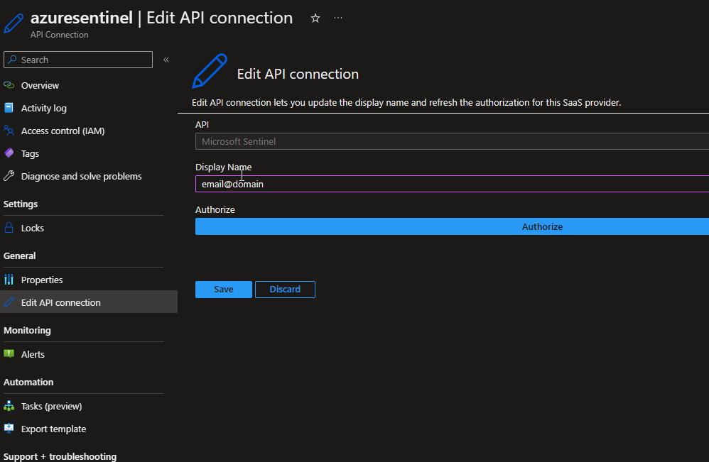

# AI Commandline Analysis with GPT-3
Author: Curtis Middlehurst

This playbook is intended to be run from a Microsoft Sentinel incident that has a Commandline entity. It will send a prompt to GPT-3 (text-davinci-003 model) and return an explanation of the commandline to the comments of the incident.

#
### Requirements

OpenAI API Key. 
# 
### Setup

Before you begin, you will need to have an API key from https://openai.com/api/. 

**USAGE OF THE OPENAI API IS NOT FREE**, please ensure you are aware of this before usage and select the appropriate plan for your organisation according to https://openai.com/api/pricing/

#
### Deployment

To configure and deploy this playbook:

Open your browser and ensure you are logged into your Microsoft Sentinel workspace.

Click the “**Deploy to Azure**” button at the bottom and it will bring you to the custom deployment template.

Ensure you select a Playbook name

Enter the username that you will use for the Azure Sentinel Connector
#
### Setting up the Connectors

Before you begin, you will need to have an API key from https://openai.com/api/. 

Go to *yourlogicappname* -> API Connections -> *azuresentinel-yourlogicappname* -> Edit API Connection
Set your display name if you haven't already and click 'authorize' to log into your account

Go to *yourlogicappname* -> API Connections -> *openaiip-yourlogicappname* -> Edit API Connection
Set the 'API Key' to 'Bearer *yourapikey*'

#

### Usage
This playbook can be ran manually or as part of an automation rule. This has been tested against incidents with a commandline entity, without a commandline entity and with multiple commandline entities and has handled each appropriately.

Once the playbook runs on an incident, the GPT-3 Analysis of any commandlines appear in the comments

#
