# AS-PagerDuty-Integration

Author: Accelerynt

For any technical questions, please contact info@accelerynt.com  

This playbook is intended to be run from a Microsoft Sentinel incident. It will create a PagerDuty event with the related Microsoft Sentinel incident and entity information.
                                                                                                                                     
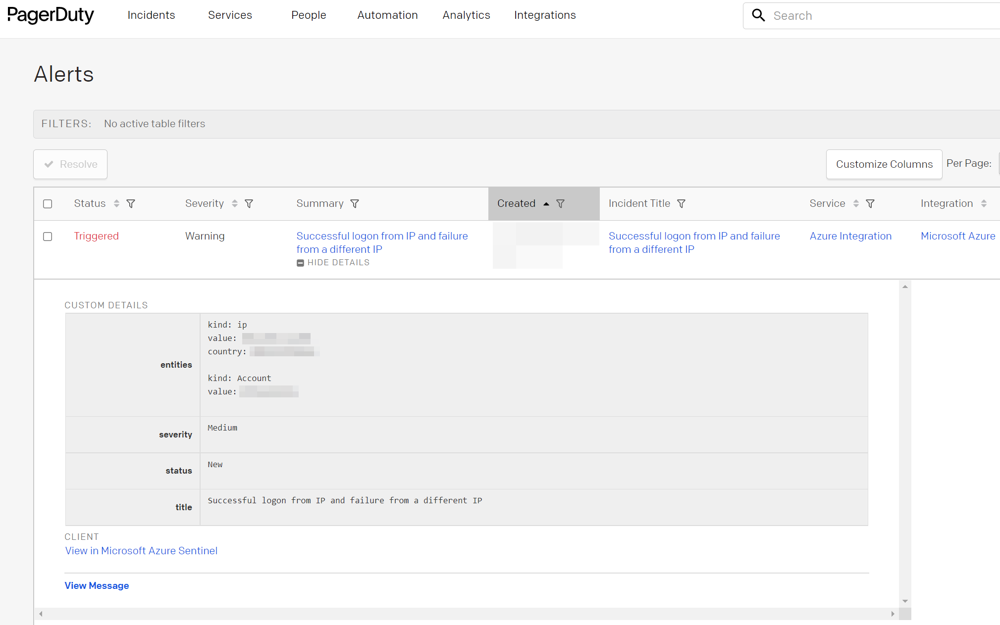
 
                                                                                                                                     
#
### Requirements
                                                                                                                                     
The following items are required under the template settings during deployment: 

* A PagerDuty integration key
                                                                                                                                    
# 
### Setup
                                                                                                                                     
To Create a PagerDuty Integration Key:
 
Log into your PagerDuty account at https://app.pagerduty.com/. Under the "**Services**" menu option, select "**Service Directory**". From the page, click the "**New Service**" button.
 
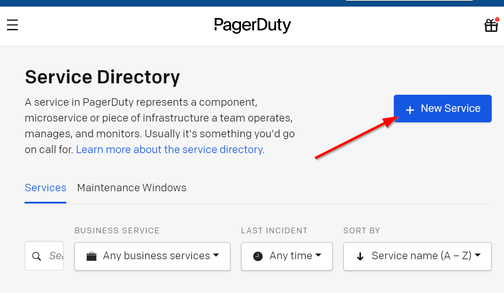

                                                                                                       
Add a Name and optional Description like the following:

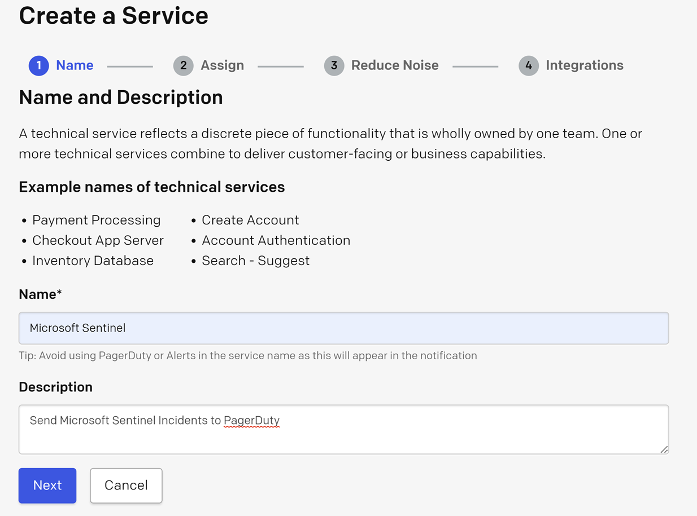              
                                                                                       
                                                                                         
Select an escalation policy for your service.

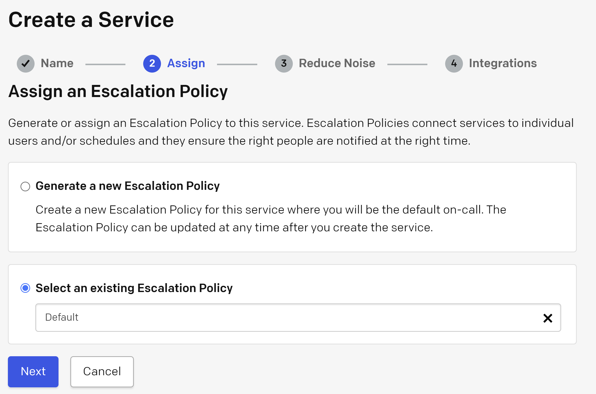

There may be a step regarding noise reduction preferences. Here, it is reccomended that you use the "**Intelligent**" option.

                                                                                           
Finally, select the Microsoft Azure option under the Integrations section, then click "**Create Service**".

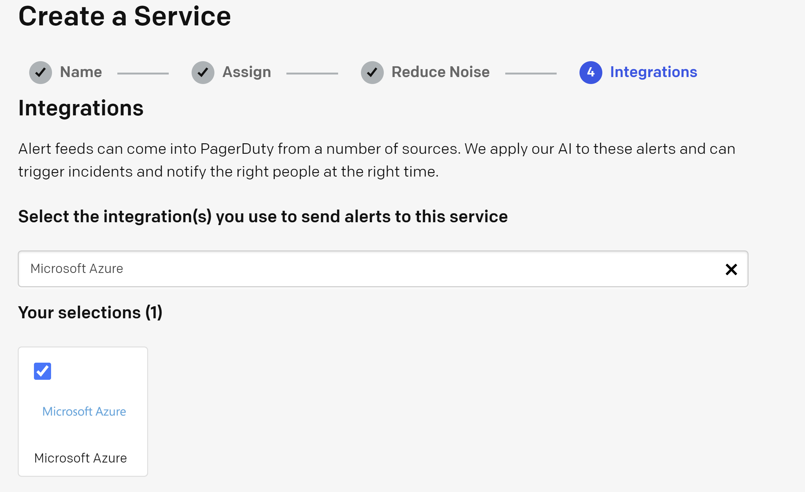

                                                                                                  
You will be redirected to the service you have created. Under the Integrations tab view, you will find your integration key. This will be needed for the deployment of this playbook.
                                                                                                  
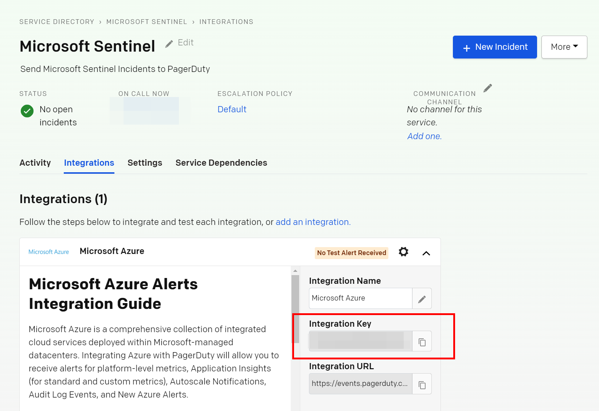
                                                                                           
                                                                                                 
#
### Deployment                                                                                                         
                                                                                                        
To configure and deploy this playbook:

                                             

Click the “**Deploy to Azure**” button at the bottom and it will bring you to the custom deployment template.

In the **Project Details** section:

* Select the “**Subscription**” and “**Resource Group**” from the dropdown boxes you would like the playbook deployed to.  

In the **Instance Details** section:   

* **Playbook Name**: This can be left as “AS-PagerDuty-Integration” or you may change it.  

* **Integration Key**: Enter the value of the PagerDuty integration key created from the first section.

Towards the bottom, click on “**Review + create**”. 

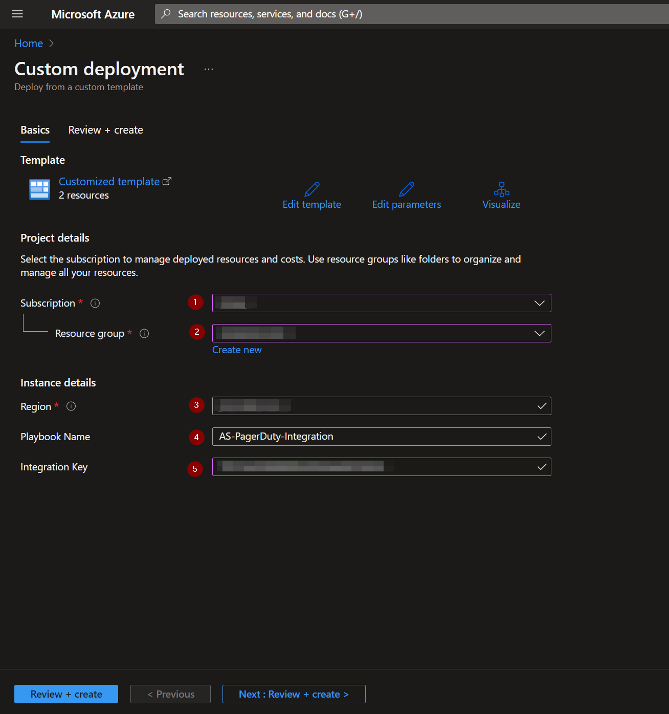

Once the resources have validated, click on "**Create**".

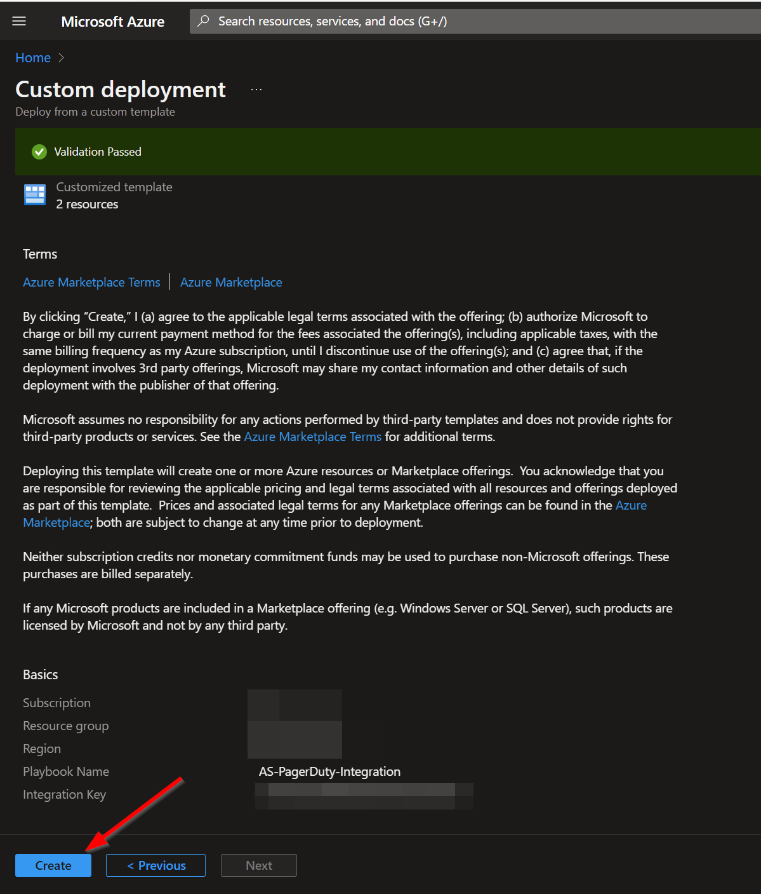

The resources should take around a minute to deploy. Once the deployment is complete, you can expand the "**Deployment details**" section to view them.
Click the one corresponding to the Logic App.

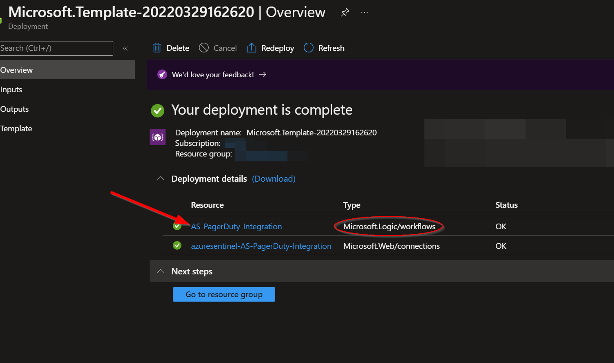

Click on the “**Edit**” button. This will bring us into the Logic Apps Designer.

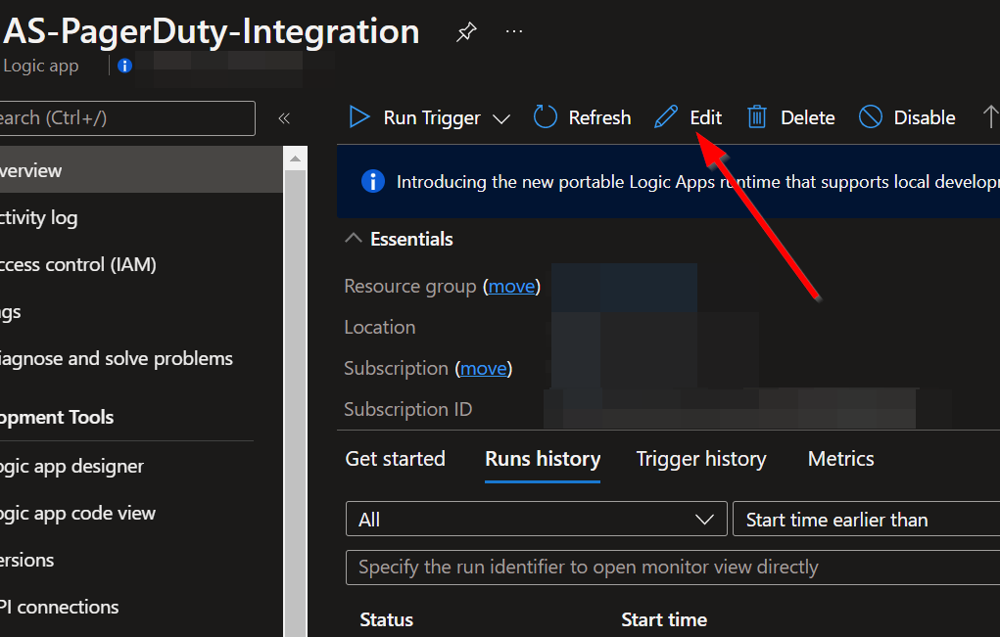

The first step labeled "**Connections**" uses a connection created during the deployment of this playbook. Before the playbook can be run, this connection will either need to be authorized in this step, or an existing authorized connection may be alternatively selected.  

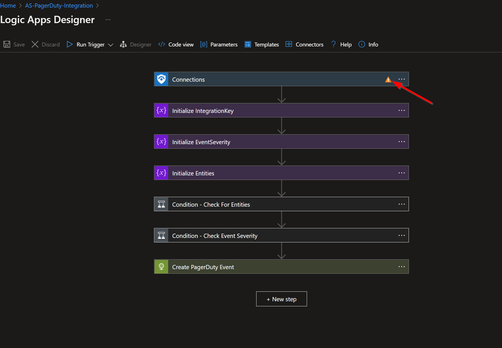

To validate the connection created for this playbook connection, expand the "**Connections**" step and click the exclamation point icon next to the name matching the playbook.
                                                                                                

When prompted, sign in to validate the connection.                                                                                                
                                                                                                
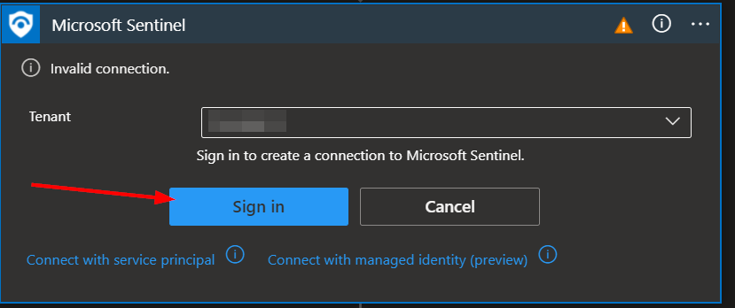                                                                                                                             
                                                                                                                             
Once the connection step has been updated, click the "**Save**" button.

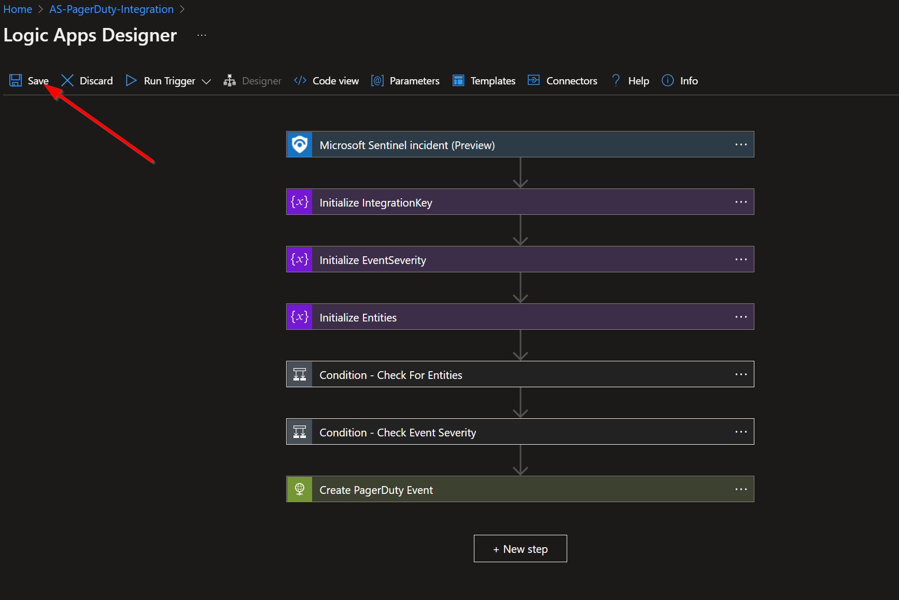  

#
### Running the Playbook
To run this playbook automatically on incidents in Microsoft Sentinel, navigate to "**Automation**" under "**Configuration**" in the left-hand menu.

Click the "**Create**" button and select "**Automation Rule**" option from the dropdown.

**1)** Enter a name for the automation rule. 

**2)** Then stipulate the conditions for which you would like a Microsoft Sentinel Incident to be sent to PagerDuty. In the example below, criteria are set so that only incidents with high severity will be sent to PagerDuty. 

**3)** Select the "**Run Playbook**" option under the "**Actions**" section. 

**4)** Then select the name of the playbook that was just deployed from this page. 

**5)** Review the default values under the "**Rule expiration**" and "**Order**" section, then click Apply.

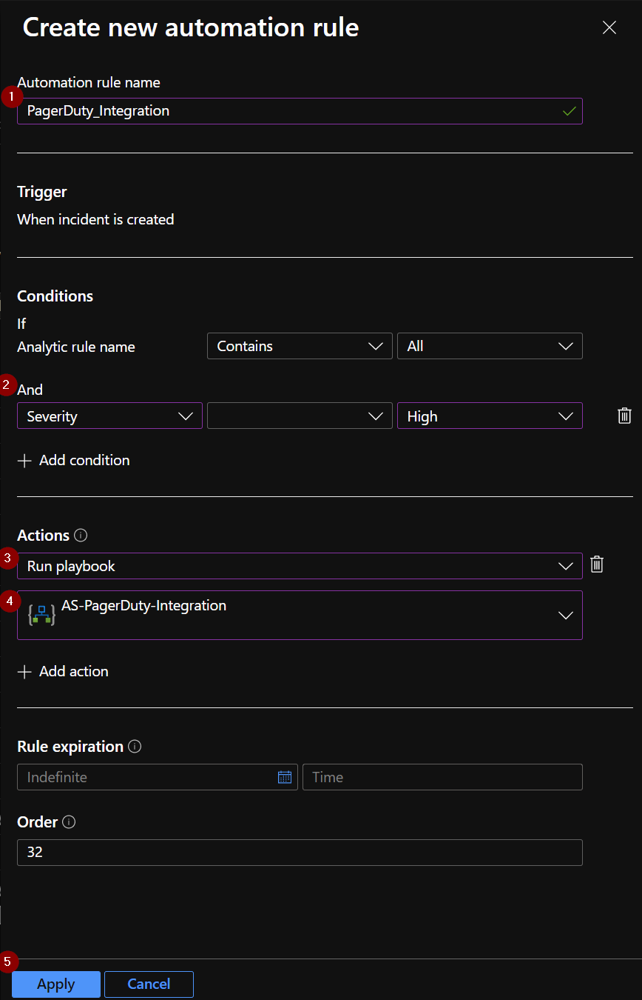

Once this saves, your new integration should run automatically.
