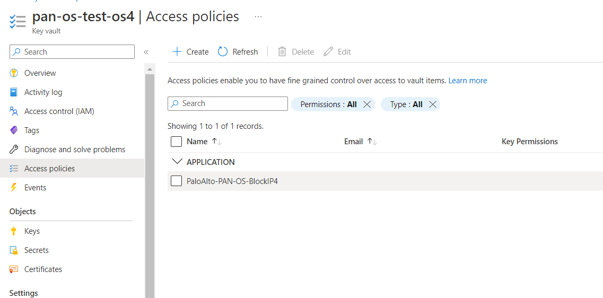

# PaloAlto-PAN-OS-GetSystemInfo OnPrem version

 ## Summary

This playbook allows us to get System Info of a Palo Alto device for a Sentinel alertt. 

When a new Sentinel incident is created, this playbook gets triggered and performs below actions:

1. Gets the various parameters from the alert

2. Gets the System Info for the device in the alert.

3. Creates a Sentinel Incident and updates it with the system info.

### Prerequisites 
1. PaloAlto connector needs to be deployed prior to the deployment of this playbook under the same subscription. Relevant instructions can be found in the connector doc page.
2. Generate an API key.[Refer this link on how to generate the API Key](https://paloaltolactest.trafficmanager.net/restapi-doc/#tag/key-generation)
3. This playbook only works for Palo Alto incidents. 

### Deployment instructions 
1. Deploy the playbook by clicking on "Deploy to Azure" button. This will take you to deploying an ARM Template wizard.

2. Fill in the required parameters:
    * Playbook Name: The playbook name here (e.g. PaloAlto-PAN-OS-GetThreatPCAP)
    * :  The blob storage account where the threat PCAP will be stored
    * LogAnalyticsResourceGroup: The Log Analytics resource group for logging for the Playbook.
    * LogAnalyticsResourceName: The Log Analytics resource for logging for the Playbook.
    * KeyVaultName: Name of Azure Key Vault that will store X-PAN-KEY
    * secretValue: value of X-PAN-KEY

    

### Post-Deployment instructions 
#### a. Authorize connections
Once deployment is complete, you will need to authorize each connection.
1.	Click the Azure Sentinel connection resource
2.	Click edit API connection
3.	Click Authorize
4.	Sign in
5.	Click Save
6.	Repeat steps for other connections such as Blob Store connextion and PAN-OS API connection (For authorizing the PAN-OS API connection, API Key needs to be provided)

#### b. Configurations in Sentinel
1. In Azure sentinel analytical rules should be configured to trigger an incident with risky IP
2. Configure the automation rules to trigger this playbook

#### c. Configuration of Azure Key Vault
1. Navigate to new automatically created Azure Key Vault. Name of Key Vault is defined in playbook parameters.
   
2. Create new Access Police with secret Get permission
   
3. Find principal by playbook name and select it
4. Click Create

## Playbook steps explained

### When Azure Sentinel incident creation rule is triggered

Azure Sentinel incident is created. The playbook receives the incident as the input.

### Run Query and List Results

Get the logs from the incident.

### For Each 

Iterates on each result and performs the following:

#### If alert is Palo Alto alert
Checks if the alert is a Palo Alto alert. Required when logs from various devices are present

##### Query XML API
Sets the device name, and queries the device's XML API to retrieve the system info for the device

###### Alert - Get Incident
Creates Incident for the alert

###### Add Comment to Incident (V3)
Adds a comment containing the system info to the incident 