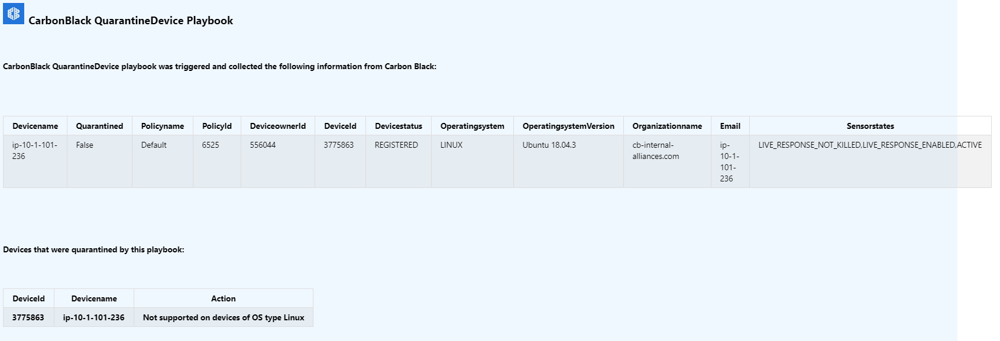
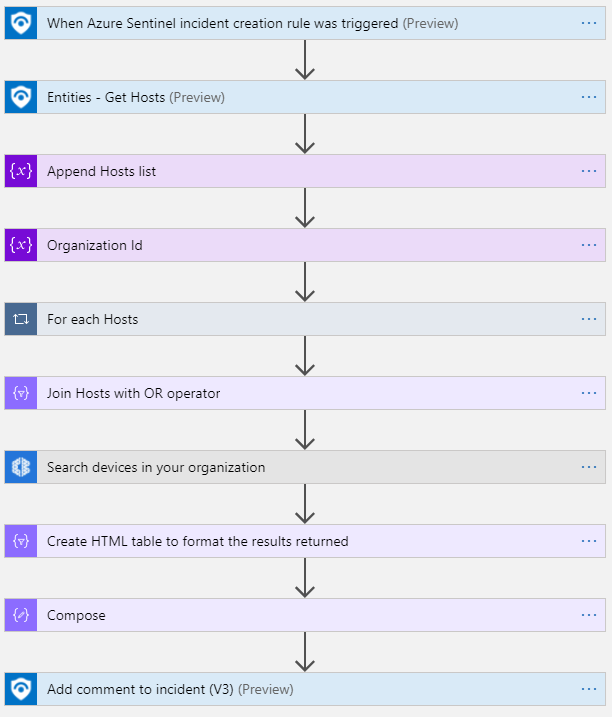
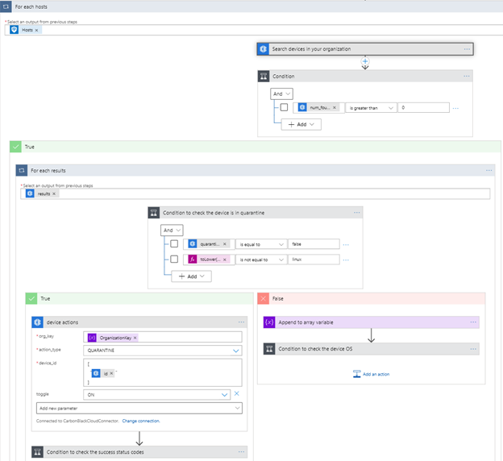

# CarbonBlack-QuarantineDevice enrich incident with device information and quarantine or change policy

> **Important**
>
> The playbooks, workbook, and analytic rules included in `\Solutions\CarbonBlack` should be deployed from the [Microsoft Sentinel content hub]('https://docs.microsoft.com/azure/sentinel/sentinel-solutions-deploy#install-or-update-a-solution') rather than being deployed using the documentation below.
>
> This solution requires the [VMware Carbon Black Endpoint Standard Sentinel data connector]('https://docs.microsoft.com/azure/sentinel/data-connectors-reference#vmware-carbon-black-endpoint-standard-preview').
>

## Summary

When a new Sentinel incident is created, this playbook gets triggered and performs following actions:

1. Retrieves device information from Carbon Black Cloud.
2. Quarantines or changes the policy for the specified device.
3. Updates the incident with device information from Carbon Black Cloud.

    
     
    

### Prerequisites

1. The Carbon Black custom connector must be already be deployed in same subscription as this playbook.
2. Know your Carbon Black Cloud API service endpoint. [Determine your Carbon Black Cloud API service endpoint.](https://developer.carbonblack.com/reference/carbon-black-cloud/authentication/#building-your-base-urls) (e.g. https://defense.conferdeploy.net)
3. Know your Carbon Black Org Key [Where is the Carbon Black Org Key found?](https://community.carbonblack.com/t5/Knowledge-Base/Carbon-Black-Cloud-Where-is-the-Org-Key-Found/ta-p/80970)
4. Create a custom Access level with the following minimum access:

   * Device > General Information > “device” allow permissions for “READ”
   * Device > Policy assignment > “device.policy” allow permissions for “UPDATE”
   * Device > Quarantine > “device.quarantine” allow permissions for “EXECUTE”
   * Search > Events > “org.search.events”, allow permission to CREATE to start a job, READ to get results, DELETE to cancel a search and UPDATE for watchlist actions.
   * Alerts > General Information > “org.alerts” allow permissions for “READ”
   * Alerts > Dismiss > “org.alerts.dismiss” allow permissions for “EXECUTE”
   * Alerts > Notes > “org.alerts.notes” allow permissions for “CREATE”, “READ”, and “DELETE”
  
5. Create an API key and Secret using the Access Level type "Custom", and the Access Level you created. [How to generate a Carbon Black Cloud API Key](https://developer.carbonblack.com/reference/carbon-black-cloud/authentication/#creating-an-api-key)

### Deployment instructions

1. Deploy the playbook by clicking on "Deploy to Azure" button. This will take you to deploying an ARM Template wizard.
2. Fill in the required parameters:
   - Playbook Name: Enter the playbook name here (Ex:CarbonBlack-QuarantineDevice)
   - OrganizationKey : Carbon Black Cloud Org Key

### Post-Deployment instructions

#### Authorize connections

Once the playbook is deployed, edit the Logic App and authorize each Carbon Black Cloud connection.

1. Click the connection resource
2. Click edit API connection
3. Click Authorize
4. Sign in
5. Click Save
6. Repeat steps two and three for each Carbon Black connector connection.

> *Note*
> The API Key must be provided as a combination {API Key}/{API ID}.

#### Configurations in Sentinel

1. In Microsoft Sentinel analytical rules should be configured to trigger an incident with risky device.
2. Configure the automation rules to trigger this playbook.

 

## Playbook steps explained

### When Microsoft Sentinel incident creation rule is triggered

Microsoft Sentinel incident is created. The playbook receives the incident as the input.

### Entities - Get Hosts

Gets list of risky devices as entities from the incident.

### Initialize variable to assign the Organization Id

Initializes an string variable to assign the Organization Id provided by Client while deploying the playbook and used a parameter while calling the search devices with organization API action.

### Initialize variable to assign the Carbon Black devices information

Initializes an array variable to assign the Carbon Black devices used as source to format the HTML with the device information.

### Initialize variable to assign the quarantined devices information

Initializes an array variable to assign the quarantined devices information used as source to format the HTML with the action takened device information.

### For each-hosts

This action performs the following actions:

  a. Make a call to Carbon Black API with the parameters [Contains device name].
  b. Verify Carbon Black returned the results and verify the device is quarantined.
  c. If the device is not quarantined then isolate it.

### Construct HTML table - Carbon Black devices information

This action constructs the HTML table with devices information.

### Construct HTML table - Quarantined devices through playbook

This action constructs the HTML table with Quarantined devices through playbook.

### Add a comment to the incident with the information

This action enriches the incident with the constructed HTML table with devices information.

### Close the comment

This action closes the incident if there is no exceptions occurred while quarantining the devices.
