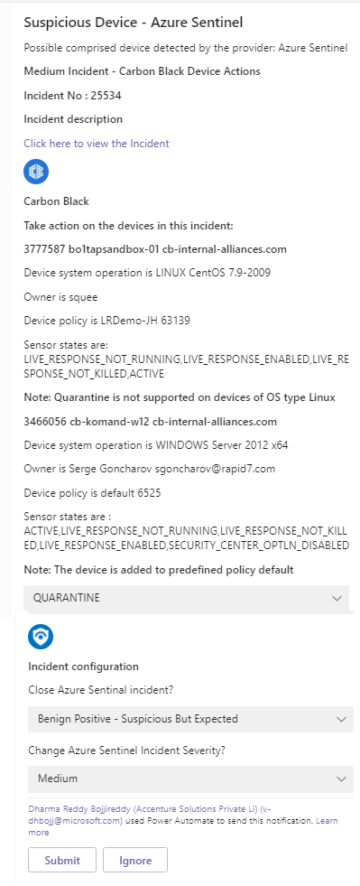
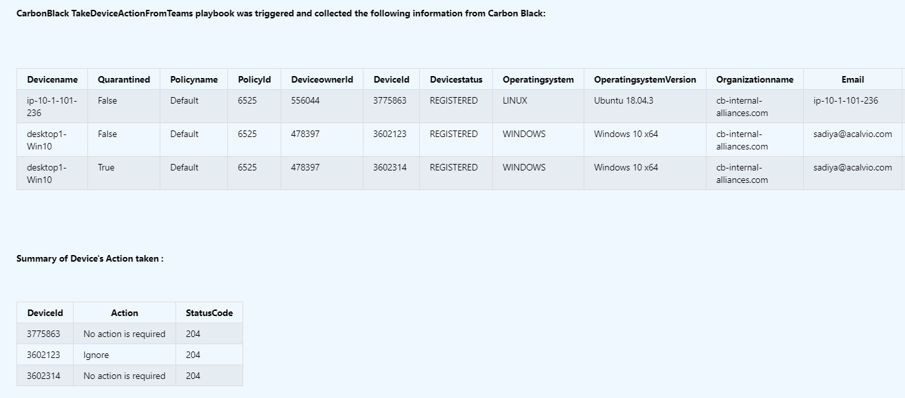

# CarbonBlack-TakeDeviceActionFromTeams playbook

> **Important**
>
> The playbooks, workbook, and analytic rules included in `\Solutions\CarbonBlack` should be deployed from the [Microsoft Sentinel content hub]('https://docs.microsoft.com/azure/sentinel/sentinel-solutions-deploy#install-or-update-a-solution') rather than being deployed using the documentation below.
>
> This solution requires the [VMware Carbon Black Endpoint Standard Sentinel data connector]('https://docs.microsoft.com/azure/sentinel/data-connectors-reference#vmware-carbon-black-endpoint-standard-preview') from the Data Connector gallery.
>

## Summary

 When a new Microsoft Sentinel incident is created, this playbook is triggered and performs the following actions:

 1. Retrieves the device information from Carbon Black Cloud.
 2. Sends an adaptive card to the SOC Teams channel, to prompt the analyst to either quarantine or change the device policy.

    

 3. Add a comment to the incident with the information collected from the Carbon Black, summary of the actions taken and close the incident.

     

### Prerequisites

1. The Carbon Black custom connector must be already be deployed in same subscription as this playbook.
2. Know your Carbon Black Cloud API service endpoint. [Determine your Carbon Black Cloud API service endpoint.](https://developer.carbonblack.com/reference/carbon-black-cloud/authentication/#building-your-base-urls) (e.g. https://defense.conferdeploy.net)
3. Know your Carbon Black Org Key [Where is the Carbon Black Org Key found?](https://community.carbonblack.com/t5/Knowledge-Base/Carbon-Black-Cloud-Where-is-the-Org-Key-Found/ta-p/80970)
4. Create a custom Access level with the following minimum access:

   * Device > General Information > “device” allow permissions for “READ”
   * Device > Policy assignment > “device.policy” allow permissions for “UPDATE”
   * Device > Quarantine > “device.quarantine” allow permissions for “EXECUTE”
   * Search > Events > “org.search.events”, allow permission to CREATE to start a job, READ to get results, DELETE to cancel a search and UPDATE for watchlist actions.
   * Alerts > General Information > “org.alerts” allow permissions for “READ”
   * Alerts > Dismiss > “org.alerts.dismiss” allow permissions for “EXECUTE”
   * Alerts > Notes > “org.alerts.notes” allow permissions for “CREATE”, “READ”, and “DELETE”
  
5. Create an API key and secret using the Access Level type "Custom", and the Access Level you created. [How to generate a Carbon Black Cloud API Key](https://developer.carbonblack.com/reference/carbon-black-cloud/authentication/#creating-an-api-key)
6. (Optional) Create a Carbon Black device policy for which to move devices, when requested using the Microsoft Teams playbook.

### Deployment instructions

1. Deploy the playbook by clicking on "Deploy to Azure" button. This will take you to deploying an ARM Template wizard.
2. Enter the required parameters:
   - Playbook Name: Enter the playbook name here (Ex:CarbonBlack-TakeDeviceActionFromTeams)
   - OrganizationKey: Enter the Carbon Back organization key.
   - PolicyId: Enter the Carbon Black policy Id to move devices.
   - Teams GroupId: Enter the Microsoft Teams group Id.
   - Teams ChannelId: Enter the Microsoft Teams channel Id.
  
      [How to find the Microsoft Teams channel and group ids](https://docs.microsoft.com/powershell/module/teams/get-teamchannel?view=teams-ps)
  
 

### Post-deployment instructions

#### Authorize connections

Once the playbook is deployed, edit the Logic App and authorize each Carbon Black Cloud and Microsoft Teams connection.

1. Click the connection resource
2. Click edit API connection
3. Click Authorize
4. Sign in
5. Click Save
6. Repeat steps two and three for each Carbon Black connector and Microsoft Teams connection.

> *Note*
> The API Key must be provided as a combination {API Key}/{API ID}.

#### Sentinel configuration

1. Sentinel analytics rule should be configured to trigger an incident with risky device.
2. Configure the automation rules to trigger this playbook.

## Playbook steps explained

### When Microsoft Sentinel incident creation rule is triggered

Microsoft Sentinel incident is created. The playbook receives the incident as the input.

### Entities - Get Hosts

Gets the list of risky devices as entities from the Incident

Initializes the following variables:

* PolicyId - Assign the pre-configured policy Id value
* OrganizationId - Assign the Organization Id
* Information - SOC will take the action based on the note
* ActionSummary - Assign the summary of the actions taken by SOC
* AdaptiveCardColumnsList - Assign the dynamically prepared columns list to show in the adaptive card [Each device information returned from Carbon Black]
* DeviceActions - Choice list contains actions information [Quarantine, Update_Policy and Ignore]
* AdaptiveCardColumnsList - Assign the dynamically prepared columns list to show in the adaptive card [Each device information returned from Carbon Black]
* AdaptiveCardBody - Assing the dynamically prepared adaptive card body
* Hosts - Assign the Hosts information
* CarbonBlackDeviceInformation - Assign the Carbon Black device information
* DevicesActionsNeeded - Assign the devices information that needs SOC action
* ComposeProductname - Compose the product name

### For each host

This action performs the following actions:

* Makes a call to Carbon Black API [Contains device name]
* Verifies the Carbon Black API response_mode
* Checks if the device is quarantined or assigned to a predefined policy
* Prepares choice lists based on the response returned by API [Quarantine, Update_Policy and Ignore]

### Compose Incident information

This action composes the incident information to show it on the adaptive card.

### Compose Adaptive card

This action composes dynamically collected devices info [actions] and choice list.

### Post an adaptive card and wait for the SOC action

This action sends an adaptive card to the SOC with the dynamically collected information.

### For each host information

This action calls the Carbon Black cloud API endpoint to take the necessary actions based on SOC (Quarantine, Update_Policy and Ignore).

### Construct HTML table - Quarantined devices through playbook

This action constructs the HTML table with Quarantined devices through playbook

### Add a comment to the incident with the information

This action enriches the incident with the constructed HTML table with devices information.

### Close the comment

This action closes the incident if there is no exceptions occurred while quarantining the devices.
