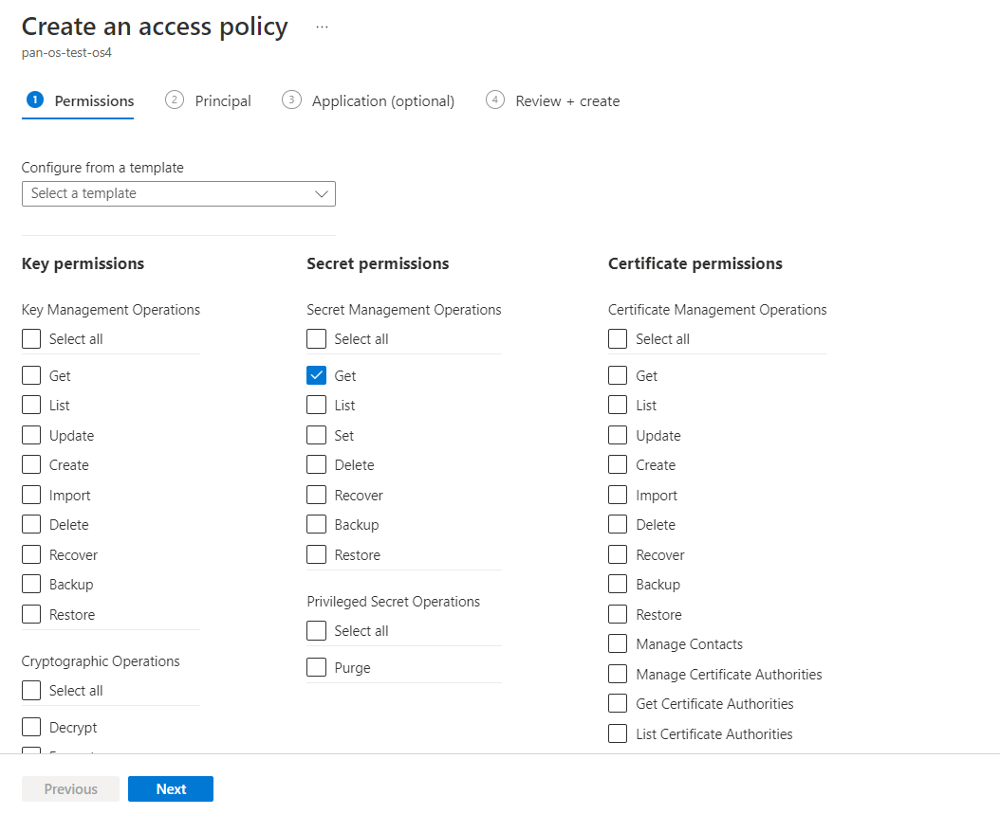

# PaloAlto-PAN-OS-GetThreatPCAP OnPrem version

 ## Summary

This playbook allows us to get a threat PCAP for a given PCAP ID. 

When a new Sentinel incident is created, this playbook gets triggered and performs below actions:

1. Gets the various parameters from the alert

2. Gets the PCAP from the device.

3. Puts the PCAP in Blob Storage

4. Creates a Sentinel Incident and updates it with a link to the blob.

### Prerequisites 
1. PaloAlto connector needs to be deployed prior to the deployment of this playbook under the same subscription. Relevant instructions can be found in the connector doc page.
2. Generate an API key.[Refer this link on how to generate the API Key](https://paloaltolactest.trafficmanager.net/restapi-doc/#tag/key-generation)
3. This playbook only works for Palo Alto incidents with a threat PCAP where the PCAP ID is not null or zero. 

### Deployment instructions 
Before playbook deployment you need to have configured KeyVault and store key as a secret in Key vault.
####Steps to configure Key vault:
#### a. KeyVault creation
1. In Azure Sentinel navigate to Key vaults.
2. Create new Key Vault and remember Key vault name.

#### b. Secret creation
1. Navigate to your created key vault
2. Go to secrets and click generate/import
3. Configure secret with X-PAN-KEY and remember its name

1. Deploy the playbook by clicking on "Deploy to Azure" button. This will take you to deploying an ARM Template wizard.

2. Fill in the required parameters:
    * Playbook Name: The playbook name here (e.g. PaloAlto-PAN-OS-GetThreatPCAP)
    * StorageAccountName:  The blob storage account where the threat PCAP will be stored
    * StorageAccountFolderPath: The folder in the blob storage account where the threat PCAP will be stored
    * LogAnalyticsResourceGroup: The Log Analytics resource group for logging for the Playbook.
    * LogAnalyticsResourceName: The Log Analytics resource for logging for the Playbook.
    * KeyVaultName: Name of Azure Key Vault that will store X-PAN-KEY
    * secretName: Name of the secret that will be stored in Key vault
    * secretValue: value of X-PAN-KEY
    * OnPremiseGatewayName: On-premises data gateway that will be used with PaloAlto connector.

    

### Post-Deployment instructions 
#### a. Authorize connections
Once deployment is complete, you will need to authorize each connection.
1.	Click the Azure Sentinel connection resource
2.	Click edit API connection
3.	Click Authorize
4.	Sign in
5.	Click Save
6.	Repeat steps for other connection such as Teams connection.

#### b. Configurations in Sentinel
1. In Azure sentinel analytical rules should be configured to trigger an incident with risky IP
2. Configure the automation rules to trigger this playbook

#### c. Configuration of Azure Key Vault
1. Navigate to  created Azure Key Vault.
   
2. Create new Access Police with secret Get permission
   
3. Find principal by playbook name and select it
4. Click Create

## Playbook steps explained

### When Azure Sentinel incident creation rule is triggered

Azure Sentinel incident is created. The playbook receives the incident as the input.

### Get Secret
Gets X-PAN-KEY from created Azure Key Vault

### Run Query and List Results

Get the logs from the incident.

### For Each 

Iterates on each result and performs the following:

#### If alert is Palo Alto alert
Checks if the alert is a Palo Alto alert. Required when logs from various devices are present

##### If PCAP ID exists
Checks if a PCAP ID is present, and that it is not equal to zero. If the PCAP ID is absent or if it is zero, no PCAP exists.

###### Query XML API
Sets the PCAP ID, time generated, Session ID and the device name, and queries the device's XML API to retrieve a threat PCAP

###### Create Blob (V2)
Creates a blob in aV2 blob storage account, denoted by Storage Account Name, in the folder denoted by the Folder Path with a name of the the type "paloalto1235678920220101102000.pcap" where the name is a concatenation of the  "paloalto"+pcapid+timegenerated+".pcap"

###### Alert - Get Incident
Creates Incident for the alert

###### Add Comment to Incident (V3)
Adds a comment containing a link to the pcap in the blob storage to the incident 

 
